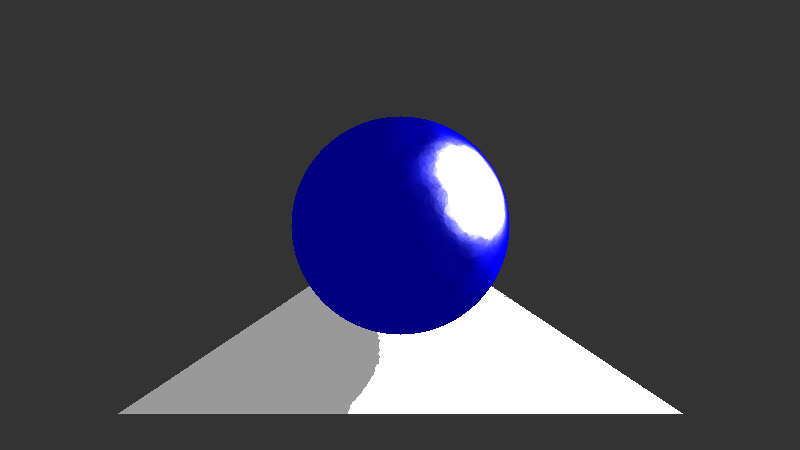
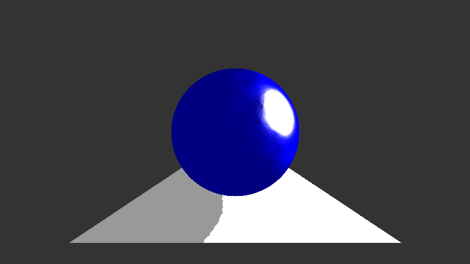
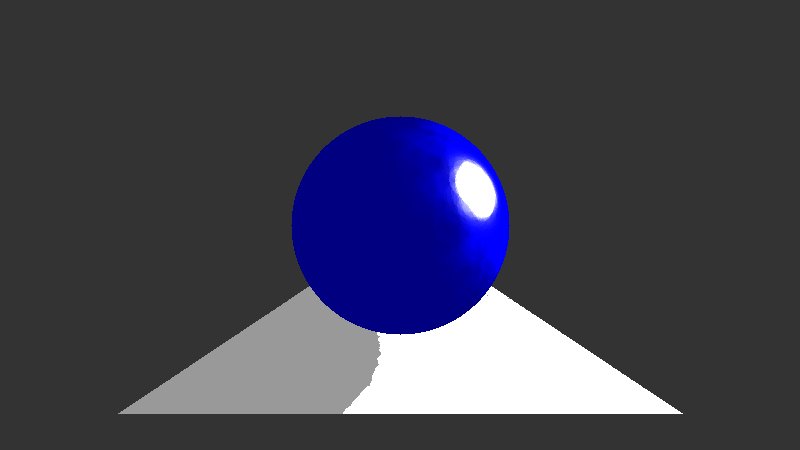
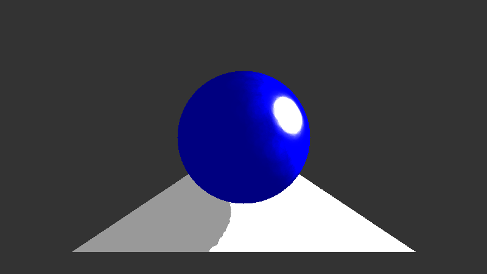
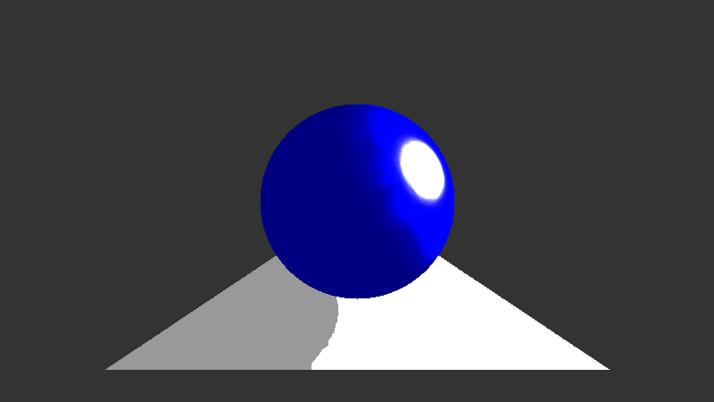

# AdvCG-Final

Many code from [three.js](https://github.com/mrdoob/three.js/)

The simplest implementation of Photon mapping.

# Result

Default Material

- color: 0x000000
- glossyFactor: 0
- Kd = Ka = Ks : 1, 1, 1

## Exp1: glossyFactor

- 100000 times random spread photons
- collection range: 5

Sphere Material

- Sphere color: 0, 0, 1
- Sphere Ka: 0.5, 0.5, 0.5
- Sphere Kd: 0.05, 0.05, 0.05
- Sphere Ks: 0.5, 0.5, 0.5

10532 photons collected

render time: 93.978 seconds

Sphere glossyFactor: 8

10481 photons collected

render time: 91.478 seconds

Sphere glossyFactor: 16

10288 photons collected

render time: 90.121 seconds

Sphere glossyFactor: 32

## Exp2: Photons Number

- collection range: 5

Sphere Material

- Sphere color: 0, 0, 1
- Sphere Ka: 0.5, 0.5, 0.5
- Sphere Kd: 0.05, 0.05, 0.05
- Sphere Ks: 0.5, 0.5, 0.5
- Sphere glossyFactor: 32

100000 times random spread photons (10288 photons collected)

render time: 90.121 seconds

200000 times random spread photons (20944 photons collected)

render time: 184.383 seconds

300000 times random spread photons (31427 photons collected)

render time: 287.818 seconds

# Lisence

The MIT License