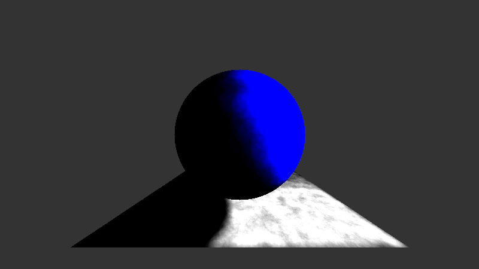

# AdvCG-Final

Many code from [three.js](https://github.com/mrdoob/three.js/)

The simplest implementation of Photon mapping.

# Result

## Diffuse render

render equation: material color * photons in range * 0.02 (* 0xFF for RGB)

100000 times random spread photons (10402 photons collected)
collection range: 7
render time: 92.195 seconds

200000 times random spread photons (20988 photons collected)
collection range: 7
render time: 192.242 seconds

300000 times random spread photons (31152 photons collected)
collection range: 7
render time: 286.749 seconds

## Fake Glossy

render equation: material color * 1/16 + (material color * 1/16 + 1/256) * photons in range (* 0xFF for RGB)

300000 times random spread photons (31635 photons collected)
collection range: 5
render time: 297.588 seconds

# Lisence

The MIT License